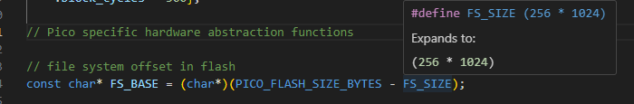

# **LAC - Light Ambient Controller**
**Frank Dantas Cunha**

[TOC]

## Introdução

### Apresentação do Projeto

O **LAC (Light Ambient Controller)** é um controlador configurável para LEDs endereçáveis com o chip **WS2812**, projetado para oferecer versatilidade na iluminação de ambientes. A configuração e o controle são realizados via **Bluetooth Low Energy (BLE)**, utilizando o microcontrolador **Raspberry Pi Pico W**.

Diferente de soluções que dependem de Wi-Fi, o LAC permite o ajuste direto via BLE, garantindo maior mobilidade e independência de redes externas. Além disso, conta com um **microfone MAX4466EXK**, que possibilita efeitos luminosos interativos em resposta ao som ambiente. O dispositivo também armazena as últimas configurações, preservando as preferências do usuário mesmo após reinicializações.


### Objetivos do Projeto

O **LAC** foi desenvolvido para proporcionar um controle de iluminação dinâmico e personalizável, sem a necessidade de conexão com a internet. Seus principais objetivos incluem:

- Permitir a **configuração via BLE**, ideal para eventos e locais onde o acesso à internet pode ser limitado.
- Atender a diferentes **perfis de iluminação**, desde efeitos vibrantes e dinâmicos até iluminação fixa e estática.
- Criar um sistema de **resposta ao som ambiente**, tornando-o ideal para shows, festas e eventos interativos.
- Garantir a **persistência das configurações**, mesmo após desligamentos ou reinicializações do sistema.


### Principais Requisitos

Os requisitos fundamentais do projeto foram:

- **Independência da internet**: A configuração dos LEDs deve ser feita via BLE, garantindo uso em qualquer ambiente sem necessidade de Wi-Fi.
- **Versatilidade na iluminação**: O sistema deve permitir tanto iluminação animada quanto estática, adequando-se a diferentes cenários.
- **Interatividade**: Deve incluir um **microfone embutido** para criar efeitos luminosos baseados no áudio do ambiente.
- **Facilidade de uso**: A comunicação entre o dispositivo e o usuário deve ser feita por meio de **comandos simples via BLE**.


### Descrição do Funcionamento

O **LAC** pode controlar até **255 LEDs WS2812** simultaneamente. Todas as configurações são feitas via BLE, utilizando comandos de texto curtos e intuitivos.

O sistema conta com **cinco modos de operação**:

- Duas animações de cores fixas que se alternam entre elas.
- Uma iluminação fixa e total, que mantém todos os leds acesos com a mesma cor.
- Duas iluminações interativas que respondem ao som do ambiente.


### Justificativa

O projeto **LAC** se destaca por sua aplicabilidade em diversos cenários, como **eventos, shows, ambientes domésticos e comerciais**. Sua implementação é viável tanto do ponto de vista técnico quanto econômico, exigindo apenas um **Raspberry Pi Pico W, um microfone MAX4466EXK e uma fonte de alimentação compatível**.

Diferente de outros sistemas, o **LAC** oferece **controle direto via BLE**, eliminando a dependência de redes Wi-Fi ou infraestrutura adicional, o que o torna ideal para **locais temporários ou de difícil acesso à internet**.

### Originalidade

Uma pesquisa sobre soluções similares revelou que a maioria dos controladores de LEDs endereçáveis disponíveis no mercado utiliza **Wi-Fi e servidores web embarcados** para o gerenciamento remoto. Essas abordagens, embora funcionais, **dependem de uma conexão de internet estável** ou de um roteador local.

O **LAC se diferencia por utilizar exclusivamente BLE**, garantindo **controle rápido, responsivo e independente de redes externas**. Além disso, a funcionalidade de **animação interativa com som ambiente** é um diferencial que amplia suas aplicações em eventos e experiências imersivas.

## Hardware

### Diagrama em blocos


### Função de cada bloco

| Bloco                  | Função                                                       |
| ---------------------- | ------------------------------------------------------------ |
| Receptor de áudio      | Esse bloco é responsável pela captura do ruído sonoro do ambiente, conversão para sinal digital e entrega desse sinal ai microcontrolador. |
| Pico W                 | Microcontrolador responsável por controlar todo o circuíto.  |
| BLE                    | Protocolo de comunicação sem fio utilizado para receber os comandos externos e enviar ao microcontrolador |
| Controlador WS2812     | Recuros PIO do microcontrolador responsável por controlar os dados de saída no pino específico para controlar os leds WS2812. |
| Indicador power on/off | Led indicador que mostra quando o sistema está em modo  stand by (descanso) ou operando com algum efeito ligado. |

### Configuração de cada bloco

| Bloco                  | Configuração                                                 |
| ---------------------- | ------------------------------------------------------------ |
| Receptor de áudio      | Esse bloco é composto por um microfone amplificador do tipo MAX4466EKX alimentado com 3.3V e com a saída analógica conectada em uma entrada ADC do Raspberry Pi Pico W. |
| Pico W                 | Representado pelo microcontrolador Raspberry Pi Pico W - RP2040, um chip dual core  ARM Cortex-M0+ com clock de até 133MHz e um chip Infineon CYW43439 que permite a conexão em redes Wifi e BLE. Possui 256KB de memória RAM, 2MB de meória flash conectada via QSPI e um RTC de alta precisão. |
| BLE                    | Esse bloco permite a conexão com outros dispositivos e é comandado pelo chip Infoneon CYW43439. |
| Controlador WS2812     | Responsável pelo controle externo da fita/matriz de leds, esse bloco é intrinsicamente conectado ao RP2040, já que o recurso PIO de controlar de máquina de estado que o microcontrolador possui é o que controla e envia os sinais para os leds conectados. |
| Indicador power on/off | Representado por um led RGB, esse bloco é um indicador do estado atual do sistema, indicando o modo espera (sem efeito ativo) ou modo ativo (com algum efeito sendo executado). |

### Especificações

O Raspberry Pico W possui uma memoria flash de 2MB além dos 256KB de RAM, recursos importante para softwares de comunicação, o que torna o microprocessador escolhido ideal para esse tipo de aplicação, além de já possuir integrado o chip para comunicação BLE, Infineon CYW43439, e  o recurso PIO que deixa a CPU livre para outras funções enquanto se comunica com os leds. Um led indicador do estado também foi inserido para identificar possíveis problemas tanto na inicialização BLE quanto no estado atual do circuito. E o amplificador MAX4466 possui uma boa precisão de captura o que permite um análise e tratamento de qualidade do som capturado.

### Lista de materiais

**Raspberry Pi Pico W**

Quantidade: 1


É o cérebro do circuito, possui 40 pinos, dos quais 26 são programáveis. Possui recursos de SPI, I2C, UART, entradas ADC com precisão de 12 bits e trabalha com nível lógico nos pinos de 3.3V. Pode ser programado com C/C++ ou MicroPython. Possui ainda:

- Microcontrolador RP2040 ARM Cortex-M0+ Dual Core
-  Chip Infineon CYW43439 Single Band 2,4 GHz e Bluetooth 5.2
- Clock 133 MHz
- Memória RAM: 256 KB
- Memória FLASH: 2 MB
- Desenvolvimento em Python ou C/C++
- Comunicação: 2×SPI, 2×I2C, 2×UART, 3×12-bit ADC, 16×canais PWM controláveis
- GPIO de 40 pinos (26 pinos multifuncionais)
- RTC (Real Time Counter) de alta precisão
- Sensor de temperatura on-board
- PIO: 8 pinos de máquina de estados programáveis

**LED RGB SDM5050**

Quantidade: 1


Possui 0,3W de potência e trabalha com tensão de 3.3V e é alto brilho.

**Microfone com MAX4466EKX**

Quantidade: 1


Um microfone de eletreto com um amplificador de ganho ajustável de 25 a 125db. Possui sensibilidade de 20Hz a 20KHz e baixo consumo de energia.

**LED WS2812**

Quantidade: 1


Um chip usado para controlar led RGB que permite o controle, por meio de endereçamento de qual led da sequência deve ser ligado. Possui um pino Din e Dout, além do VCC e GND.

### Descrição da pinagem usada

| GPIO no Raspberry Pi Pico W | Componente externo conectado  |
| --------------------------- | ----------------------------- |
| 7                           | Din do primeiro led WS2812    |
| 28                          | Saída do amplificador MAX4466 |
| 13                          | Pin vermelho do led RGB       |
| 11                          | Pin verde do led RGB          |

### Circuito completo do hardware

Representação do circuito.

Alimentação: 5V


## Software

### Blocos funcionais e descrição


| Camada          | Descrição                                                    |
| --------------- | ------------------------------------------------------------ |
| PIO             | Interface programavel para envio dos comandos seguindo o protocolo específico dos leds WS2812, eliminando trabalho da CPU. |
| Comunicação BLE | Interface de comunicação sem fio Bluetooth Low Energy, responsável pelo tráfego de dados entre o dispositivo e o aplicativo controlador. |
| Aplicação       | Responsável pelo processamento central do código, trabalha os dados recebidos por BLE, e controla os comandos enviados à camada PIO. |
| Persistência    | Camada responsável por salvar configurações do usuário na flash do dispositivo. |

### Definição das variáveis importantes

| Variável                        | Descrição                                                    |
| ------------------------------- | ------------------------------------------------------------ |
| adv_data                        | Armazena informações do "anúncio" do dispositivo BLE         |
| comunicacao_data                | Contém os dados recebidos por BLE                            |
| hci_event_callback_registration | Registra o callback para as funções do BLE.                  |
| config                          | Armazena configurações atuais do dispositivo como quantidade de leds, cores e efeitos atuais. |

### Fluxograma – desenhe o fluxograma completo do software.


### Código fonte

O código completo pode ser encontrado em: https://github.com/frankdantas/hbr-projeto-final/tree/main/software/controlador_ble

### Inicialização

O software inicia configurando os GPIOs de entrada e saída de microfone e led de status, em seguida tenta a inicialização do BLE (anúncio e registro dos callback) e caso não seja possível  inicializar, o led vermelho fica piscando, indicando que não foi possível ligar o dispositivo de forma correta. Caso o BLE seja iniciado com sucesso, então é feita a leitura das configurações salvas previamente pelo usuário, inicialização da state machine do PIO no GPIO correspondente, inicio de *timers* e então o loop principal do programa é iniciado.

### Configurações dos registros

Não foi necessário a manipulação de nenhum registro específico.

### Estrutura e formato dos dados

Os dados transferidos por BLE respeitam a limitação de 31bytes por pacote, e nessa aplicação são em sua totalidade caracteres UTF-8 para facilitar o entendimento do software.

Já a estrutura de dados utilizada para armazenamento das configurações do dispositivos é uma struct básica, mostrada abaixo:

```c
typedef struct __attribute__((packed)){
    uint8_t amountLeds;//Quantidade de leds controlados
    uint8_t colunasLed;//Colunas de led (no caso de uma matriz igual à BitDogLab)
    uint8_t efeitoAtivo;// Numero do efeito ativo
    uint32_t mainColor;//Cor principal para o 1, 2 e 4
    uint32_t secondColor;//Cor secundária do efeito 2
    uint32_t fullColor;// Cor do efeito 3
}config_t;
```


### Organização da memória

O único recurso que precisou de fato ter um endereço definido na memória foi o recurso para o FileSystem, utilizando a biblioteca externa LittleFS. Que utiliza os últimos 256KB da memória flash externa conectada via QSPI disponível (de 2MB) para o sistema de arquivos.



Esse recurso utiliza acesso à flash a partir de chamadas de funções da stdio, foi utilizado a biblioteca *pico-littlefs* do *lurk101*. Para acessar e salvar a estrutura de dados de configuração na flash.

### Protocolo de comunicação

O BLE funciona na mesma banda industrial, científica e médica (ISM) de 2,4 GHz que o bluetooth padrão e também usa canais diferentes do bluetooth padrão. O BLE usa 40 canais de 2 MHz para transmitir dados usando modulação gaussiana de mudança de frequência (um método usado para transições mais suaves entre pulsos de dados), fazendo com que o salto de frequência produza menos problemas de interferência em comparação com as comunicações Bluetooth padrão. 

O espectro espalhado de sequência direta é usado na tecnologia BLE para reduzir a interferência causada pelas transmissões de sinal BLE. As tecnologias Bluetooth padrão usam o método de espectro espalhado por salto de frequência (FHSS) para transmitir sinais de rádio que produzem interferência significativa em comparação com BLE. *(Retirado do website: litum.com)*

Para o dispositivo LAC o BLE funciona no modo servidor, esperando com que clientes conectem em seus serviços. Foi gerado um UUID aleatório para o tipo de serviço que a característica oferece, esse valor é importante para identificação de alterações nas configurações e valores das características e funcionam para que os dados sejam escritos e lidos nas características corretas.

Nesse projeto a característica usa o UUID: 1191e8b3-5c6b-417c-b7b5-813ec84a757e

Que foi configurado no arquivo *comunicacao.gatt*.

### Formato do pacote de dados

Os dados que controlam o dispositivo são no formato UTF-8, e seguem um formato **COMANDO=VALOR**. É possível controlar o dispositivo escrevendo na característica correta o comando e valor que deseja enviar. Abaixo uma tabela dos comandos e valores possíveis.

| Comando | Descrição                                                    |
| ------- | ------------------------------------------------------------ |
| NL=XX   | Usado para configurar o número de leds que deseja controlar, o padrão é 25. XX indica o novo número de leds. Ex.: **NL=20** define a quantidade de leds para 20. |
| EF=XX   | Esse comando é usado para indicar qual efeito deseja ativar, está disponível do 0 ao 5, onde 0 significa desligado. Ex.: **EF=2** ativa o efeito 2. |
| MC=XX   | Define a cor principal no formato hexadecimal de 6 dígitos. Ex.: **MC=FF0000** define a cor vermelha para cor principal. |
| SC=XX   | Define a cor secundária no formato hexadecimal de 6 dígitos. Ex.: **MC=00FF00** define a cor verde para cor secundária. |
| FC=XX   | Define a cor para o efeito 3 (Full Color) no formato hexadecimal de 6 dígitos. Ex.: **MC=FFFFFF** define a cor branca para cor do efeito. |
| SA=XX   | Multiplicador para a sensibilidade do ADC do microfone, funciona para multiplicar a leitura, causando a impressão de aumentar a sensibilidade. Ex.: **SA=2** define a sensibilidade para 2. Pode ser um valor entre 1 e 5. |
| QC=XX   | Define a quantidade de colunas para efeitos onde os leds estão dispostos em matriz bidimensional. Ex.: **QC=5** define a quantidade de colunas para 5. |
| SAVE    | Salva as configurações atuais na flash do dispositivo. Ex.: **SAVE** |


## Execução do projeto

### Metodologia

Com base nos requisitos fornecidos para o projeto final, o primeiro passo foi definir um tema que fosse útil, desafiador e que agregasse conhecimento, além de estar alinhado com os componentes e recursos disponíveis na BitDogLab.

Após a análise de diversas ideias, optou-se pelo desenvolvimento de um controlador para LEDs endereçáveis WS2812, devido à riqueza de efeitos visuais que esses LEDs proporcionam e à possibilidade de explorar o uso do PIO (Programmable Input/Output) do Raspberry Pi Pico W.

Com a escolha do hardware definida, foi necessário decidir como os LEDs seriam controlados. Considerou-se inicialmente o uso de botões físicos ou um joystick, mas essa abordagem parecia limitada. A alternativa natural foi o controle sem fio, inicialmente pensado para Wi-Fi. No entanto, após pesquisas, percebeu-se que a maioria dos dispositivos IoT utilizam Wi-Fi, o que pode trazer algumas limitações:

- Dependência de um roteador ou de uma rede local.
- Desconexão do usuário de sua rede principal caso o dispositivo crie uma rede temporária.

Para evitar esses problemas e oferecer uma solução mais prática e eficiente, decidiu-se pelo uso do Bluetooth Low Energy (BLE). Além de proporcionar baixo consumo de energia, o BLE permite configurar o dispositivo sem desconectar o usuário da internet, tornando a experiência mais fluida. Além disso, poucos projetos documentados utilizam BLE no Raspberry Pi Pico W, o que representava um desafio adicional e uma oportunidade de aprendizado.

Com os principais recursos definidos, a próxima etapa foi planejar como integrá-los de forma eficiente. Inicialmente, a ideia era apenas permitir o controle dos efeitos luminosos dos LEDs, mas isso parecia limitado. Para tornar o projeto mais flexível e personalizável, foram adicionadas funcionalidades que permitissem ao usuário:

- Definir a quantidade de LEDs controláveis, tornando o sistema adaptável a diferentes cenários.
- Personalizar as cores e os efeitos luminosos, ampliando a gama de possibilidades visuais.

Após a implementação dessas funcionalidades, surgiu a necessidade de salvar as configurações do usuário, para que o dispositivo pudesse manter o último estado mesmo após ser reiniciado. Foi então realizada uma pesquisa sobre armazenamento interno no Pico W, buscando uma solução que não exigisse um cartão SD externo. Após testes, encontrou-se um recurso adequado para essa finalidade, que foi implementado com sucesso.

O software foi desenvolvido utilizando o SDK em C do Raspberry Pi Pico W. A programação e a depuração foram realizadas na IDE Visual Studio Code, utilizando a ferramenta printf para depuração, especialmente para entender o funcionamento do BLE no dispositivo.

Durante o desenvolvimento, foram realizados diversos testes para validar:

- A comunicação BLE e a recepção correta dos comandos.
- O funcionamento do PIO para o controle preciso dos LEDs WS2812.
- A persistência dos dados após reinicializações.

A cada etapa, ajustes foram feitos para garantir a estabilidade e a confiabilidade do sistema.

### Testes de validação 

Os testes realizados focaram na verificação da estabilidade e funcionalidade do sistema. As principais validações incluíram:

- **Conexão e desconexão BLE** – Testes para garantir uma conexão estável com o dispositivo remoto, sem quedas inesperadas.
- **Escrita e leitura de dados na característica BLE** – Validação da integridade dos dados transmitidos e recebidos.
- **Persistência de configurações** – Teste da funcionalidade de salvar e recuperar configurações após reinicializações do dispositivo.
- **Conversão de cores** – Garantia de que os valores de cores enviados pelo BLE eram corretamente interpretados e aplicados aos LEDs.
- **Troca de efeitos** – Avaliação da resiliência do sistema ao alternar entre diferentes modos de iluminação sem travamentos ou falhas.

### Discussão dos Resultados

Os testes demonstraram resultados **altamente satisfatórios**. O sistema apresentou um **controle eficiente da quantidade de LEDs**, respondendo bem aos comandos e mantendo a fluidez dos efeitos visuais esperados.

Os principais destaques observados foram:

- **Confiabilidade da conexão BLE** – A comunicação manteve-se estável e responsiva, sem perdas de pacotes ou desconexões inesperadas.
- **Execução correta dos comandos** – Os dados foram transmitidos e interpretados integralmente, sem quebras ou falhas.
- **Armazenamento persistente** – O dispositivo foi capaz de salvar e restaurar corretamente as configurações após reinicializações, desde que o comando "SAVE" fosse utilizado.
- **Resiliência na troca de efeitos** – O sistema alternou entre os diferentes modos de iluminação sem interrupções ou atrasos perceptíveis.

Além da estabilidade e confiabilidade, o projeto se destacou pela portabilidade e autonomia, pois não requer uma conexão Wi-Fi para funcionamento. Isso amplia suas aplicações para diferentes ambientes e contextos, como eventos, decoração e automação.

### Faça um vídeo de no máximo 3 minutos mostrando seu projeto funcionando. Inclua o link do vídeo no seu relatório de entrega.	(1 ponto)

  O vídeo deve ser enviado na forma de um link do YouTube. Se o aluno desejar que o vídeo não seja público, pode ser um vídeo **não listado**.

## Referências

https://www.pcbway.com/project/shareproject/WS2812B_RGB_LED_Controller_with_ESP8266_via_WiFi_29de3d12.html

https://www.youtube.com/watch?v=WszzmkpDbmA&ab_channel=NobodyReally...

https://github.com/BitDogLab/BitDogLab/tree/main

http://dqsoft.blogspot.com/2022/08/usando-o-wifi-da-raspberry-pi-pico-w.html

https://www.ledvance.com.br/00_Free_To_Use/asset-13018249_ebook_como_especificar_fitas_led_em_seu_projeto.pdf

https://www.sinos-led.com.br/quarto-gamer-dicas-para-usar-fita-led-na-decoracao?srsltid=AfmBOopZbB68_5g9X_-hWLlou7la2Dlhl6INDfQdm__WXSL6xfp2gdoa

https://www.youtube.com/watch?v=0V18vEx-Ahc&ab_channel=P%C3%A9talaArquiteturaeInteriores

https://github.com/BitDogLab/BitDogLab-C/tree/main/neopixel_pio

https://www.instructables.com/ESP8266-Connected-WS2812-RGB-LED-Controlled-Throug/

https://datasheets.raspberrypi.com/picow/connecting-to-the-internet-with-pico-w.pdf

https://github.com/bluekitchen/btstack/blob/master/example/gatt_counter.c

https://github.com/lurk101/pico-littlefs

https://www.uuidgenerator.net/version4

https://datasheets.raspberrypi.com/rp2040/rp2040-datasheet.pdf

https://www.adafruit.com/product/1063

https://www.eletrogate.com/led-rgb-5050-smd-10-unidades

https://www.makerhero.com/produto/raspberry-pi-pico-w/?srsltid=AfmBOoppw8a8O0B_ltc4hoQJkwQlTTYR_RdFBva-CVl4f6VSJ9eMtm1U

https://www.reddit.com/r/embedded/comments/1byxt04/attribute_packed_in_embedded_systems_pros_and_cons/?rdt=60122

https://litum.com/what-is-ble-how-does-ble-work/

https://www.bluetooth.com/wp-content/uploads/Files/Specification/HTML/Assigned_Numbers/out/en/Assigned_Numbers.pdf?v=1739919499427

https://www.gta.ufrj.br/ensino/eel879/trabalhos_vf_2012_2/bluetooth/implementacao.htm

https://developer-android-com.translate.goog/develop/connectivity/bluetooth/ble/ble-overview?_x_tr_sl=en&_x_tr_tl=pt&_x_tr_hl=pt&_x_tr_pto=tc